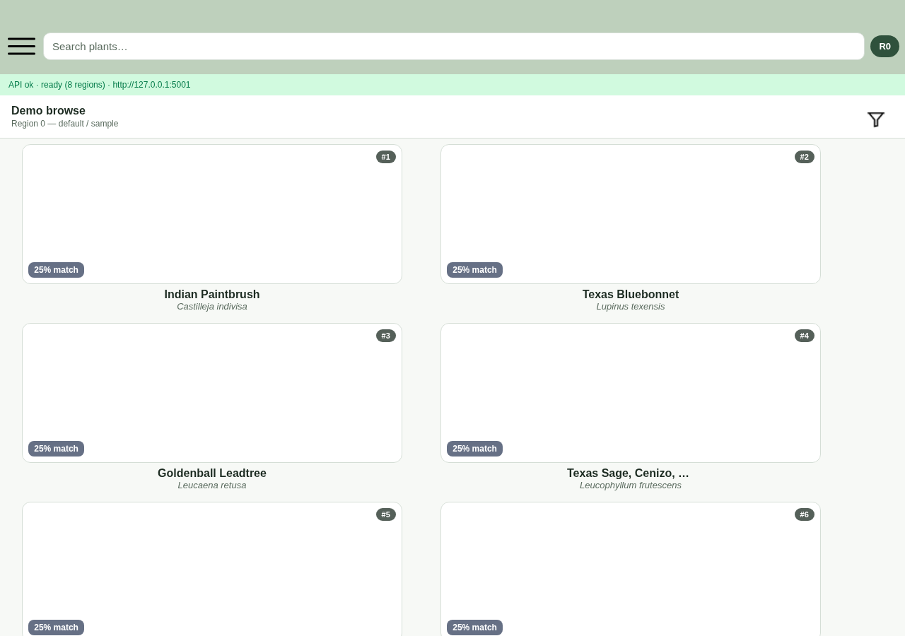

# PLAN-IT

Plant recommendation app (Expo / React Native + Flask) built around
Texas A&M Earth-Kind plant data. Search and filter plants for a region;
the Backend scores matches and the client shows ranked results with the
percent-match from that scorer.



Local Expo web screenshot (2026-09-14): **Browse plant matches (no account)** against Flask on port 5001. Rank and percent-match come from `POST /search`. Remote Earth-Kind plant photos may fail to load (upstream 301s).

| Layer | Path | Notes |
|-------|------|--------|
| Backend | [`Backend/`](Backend/) | Flask API, Docker, tests. See [`Backend/README.md`](Backend/README.md) |
| Frontend | [`Frontend/`](Frontend/) + root `App.js` | Expo app (iOS / Android / web) |

Built collaboratively at UT Austin in 2023 and later extended with backend validation,
tests, Docker, and CI.

Firebase handles authentication and garden storage. Client configuration lives in
`Frontend/src/firebase-config.js`; the platform files `google-services.json` and
`GoogleService-Info.plist` are gitignored and are not needed for the browse path.

## Demo

You need **two terminals**: API on `5001`, then Expo web.

1. Start the Backend (see [Run Locally](#run-locally)).
2. `npx expo start --web` from the repo root.
3. Landing shows an **API status** strip (`/health` / `/ready`).
4. Tap **Browse plant matches (no account)**, which needs no Firebase.
5. Ranked cards show `#` + percent-match from the scorer. Search, the filter funnel, or tap **R0** to cycle regions 0–7.
6. Open a plant card for the **preference match** explanation.

Sign-in and gardens use Firebase and need a valid project config. That path is optional if you only want the ranking UI.

## Results

From the screenshot above (real local run, region 0, empty-filter browse):

- API `ok · ready (8 regions)` at `http://127.0.0.1:5001`
- Ranked plants (Indian Paintbrush, Texas Bluebonnet, Goldenball Leadtree, Texas Sage, …)
- Percent-match badges from the Backend scorer

Empty-filter browse uses the text-only `/search` path and often lands on a floor score around 25% until you apply sun, color or season filters. Applying filters raises the score because the scorer weights matched preferences.

## Run Locally

### 1. Backend

```bash
cd Backend
python -m venv .venv
source .venv/bin/activate   # Windows: .venv\Scripts\activate
pip install -r requirements-dev.txt
export PLANT_DATA_PATH="$(pwd)/pants_filtered.csv"
python app.py               # http://0.0.0.0:5001
```

Sanity check:

```bash
curl -s http://127.0.0.1:5001/health
curl -s http://127.0.0.1:5001/ready
```

### 2. Frontend (web)

```bash
# from repo root
npm install
npx expo start --web
```

Or: `npm run web`.

### API base URL

Default: `http://127.0.0.1:5001` (see `Frontend/src/api-calls.js`).

Override without code changes:

```bash
EXPO_PUBLIC_API_URL=http://127.0.0.1:5001 npx expo start --web
```

On web you can also set `window.__PLANIT_API_URL__` before the bundle runs.

### Mobile

```bash
npx expo start          # then scan with Expo Go
# or: npm run android / npm run ios
```

Point the device/emulator at a reachable API host (not `127.0.0.1` from a
physical phone) via `EXPO_PUBLIC_API_URL`.

## What the frontend covers

- Client calls `/health`, `/ready`, `/init`, `/search`, `/get-plant` with structured errors
- Loading / empty / error + retry on the results screen
- Rank and percent-match badges, plus a “preference match” detail card
- A browse path that works without signing in

The match percentage comes from the Backend scorer.

## Layout (high level)

```
App.js                 # navigation + API boot
Frontend/
  pages/               # landing, plants, filters, garden, auth
  src/api-calls.js     # Flask client
  src/theme.js         # shared colors / score helpers
Backend/               # Flask API
```
